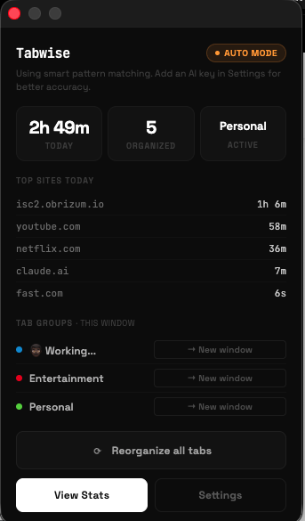
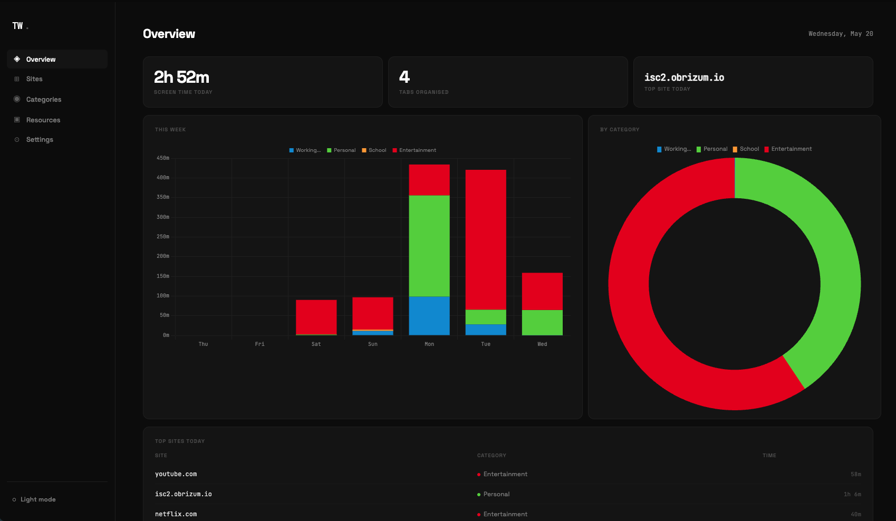
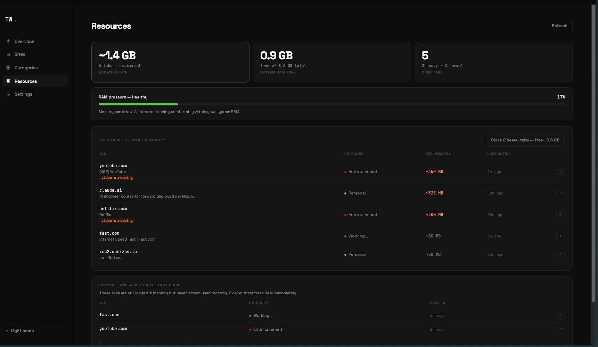
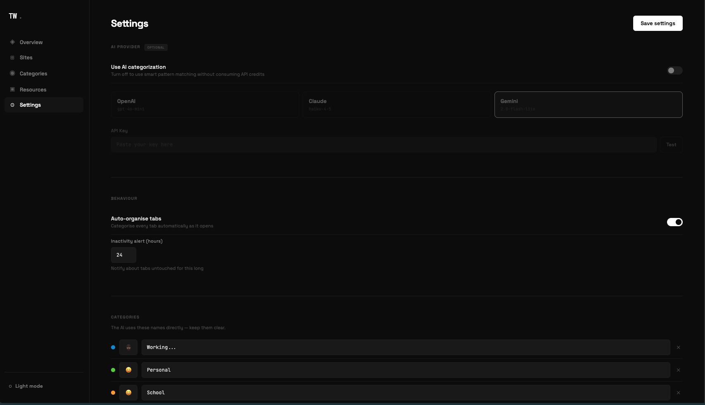

<div align="center">
  

  # Tabwise

  **Organize your tabs automatically. Track where your time goes.**

  [](LICENSE)
  [](https://www.typescriptlang.org/)
  [](https://developer.chrome.com/docs/extensions/mv3/intro/)
  [](https://vitejs.dev/)

</div>

---

## What Tabwise does

Tabwise watches your tabs and automatically sorts them into groups — Work, Personal, Entertainment, or any custom category you define. It tracks how long you spend on each site and surfaces the data in a clean dashboard. No manual sorting. No tab chaos.

It works from day one without any setup. Add an AI key in Settings if you want better accuracy on unfamiliar sites.

---

## Features

- **Auto tab grouping** — every new tab is categorised and moved into a Chrome group instantly
- **AI or offline** — works without an API key using built-in pattern matching; add OpenAI, Claude, or Gemini to improve accuracy on unfamiliar sites
- **Learns from corrections** — reassign a tab once and Tabwise remembers that site forever
- **Screen time dashboard** — daily totals, weekly bar chart, per-category breakdown, top sites
- **Memory tracker** — see estimated RAM usage per open tab; close idle tabs in one click
- **Move groups to windows** — split any tab group out to its own Chrome window from the popup
- **Fully local** — all data lives in your browser. No accounts, no servers, no cloud sync

---

## Screenshots



*Popup — live stats, tab groups, and one-click reorganise*



*Dashboard — screen time by day, category breakdown, top sites*



*Resources — estimated RAM per open tab, idle tab detection*



*Settings — AI provider toggle, custom categories, data export*

---

## Installation

### Developer mode (build from source)

**Requirements:** Node.js 18+, and one of the supported browsers below

**Supported browsers:** Chrome · Brave · Dia (any Chromium-based browser)

```bash
git clone https://github.com/adeyemiiiii7/tabwise.git
cd tabwise
npm install
npm run build
```

Then load the extension:

| Browser | Extensions page |
|---------|----------------|
| Chrome | `chrome://extensions` |
| Brave | `brave://extensions` |
| Dia | `dia://extensions` |

1. Open the extensions page for your browser (links above)
2. Enable **Developer mode** (toggle, top-right)
3. Click **Load unpacked** → select the `dist/` folder
4. Click the Tabwise icon in your toolbar and complete the short onboarding

---

## AI Providers (all optional)

Tabwise works without any API key. Adding one improves categorisation accuracy on sites it hasn't seen before.

| Provider | Model | Get a key |
|----------|-------|-----------|
| OpenAI | gpt-4o-mini | [platform.openai.com/api-keys](https://platform.openai.com/api-keys) |
| Anthropic (Claude) | claude-haiku-4-5 | [console.anthropic.com/settings/keys](https://console.anthropic.com/settings/keys) |
| Google (Gemini) | gemini-2.0-flash-lite | [aistudio.google.com/apikey](https://aistudio.google.com/apikey) |

Once you have a key: open the popup → **Settings** → **AI Provider** → paste your key → Save.

You can also toggle AI off at any time (Settings → AI Provider → Use AI categorization) to switch back to pattern matching without losing your key.

---

## Privacy

Tabwise has no backend. All your data — screen time, tab history, learned categorisations, your API key — stays in your browser's local storage.

The only time anything leaves your device is when you configure an AI provider: Tabwise sends a tab's **URL and title** to that provider's API to determine its category. Nothing else is transmitted. Tabwise never sees this data.

→ [Full privacy policy](PRIVACY.md)

---

## Development

```bash
npm run dev    # watch mode — rebuilds on every file save
```

After each build, go to your browser's extensions page (`chrome://extensions`, `brave://extensions`, or `dia://extensions`) and click the reload button next to Tabwise.

See [CONTRIBUTING.md](CONTRIBUTING.md) for the full development guide, project structure, and how to add a new AI provider.

---

## Contributing

Contributions are welcome. Please read [CONTRIBUTING.md](CONTRIBUTING.md) before opening a PR.

For bugs and feature requests, use the [GitHub Issues](https://github.com/adeyemiiiii7/tabwise/issues) templates.

---

## License

MIT — © 2025 adeyemi

See [LICENSE](LICENSE) for the full text.
